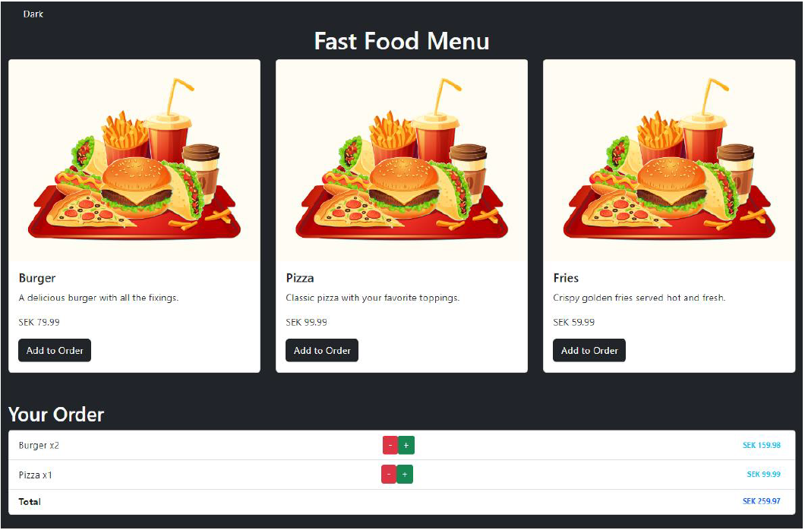

 # [FastFoodApp React + Vite](https://valeriiborisenko.github.io/fast-food-app/)

**Task:** Build a Fast-Food Ordering App with ReactJS.

**Objective:** Your task is to construct a fast-food ordering app using ReactJS. The app should include key functionalities such as displaying the menu, adding items to the order list, managing the number of items, calculating the total price, and implementing dark/light theme switching

**Functionalities:**
1. Display Fast Food Menu
2. Implement Add to Order Functionality
3. Implement Quantity Management
4. Implement Dark/Light Theme Toggle

